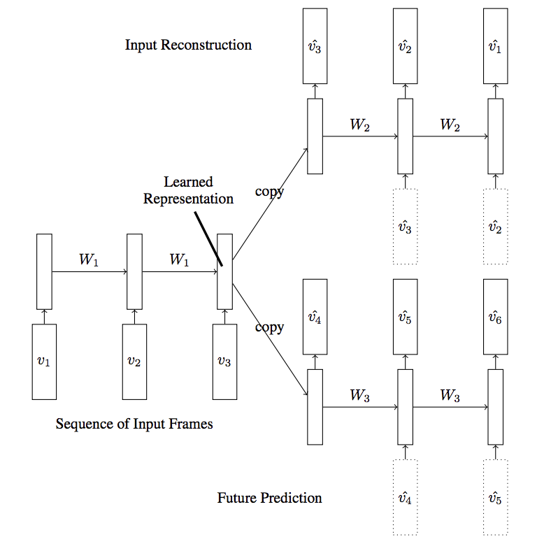

# LSTM-encoders
Encoder-Decoder LSTM architecture. Implementation of an autoencoder for sequence of data using Encoder-Decoder LSTM architecture. You could use this to encode or compress a sequence of data.

 
Type of LSTM autoencoder with one decoder
 

 
The LSTM autoencoder with two decoders
 
