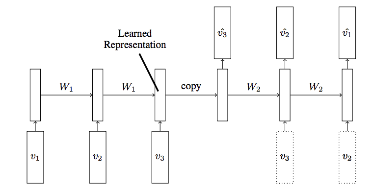

# LSTM-encoders
Encoder-Decoder LSTM architecture. Implementation of an autoencoder for sequence of data using Encoder-Decoder LSTM architecture. You could use this to encode or compress a sequence of data.

Type of LSTM autoencoder with one decoder

The LSTM autoencoder with two decoders
